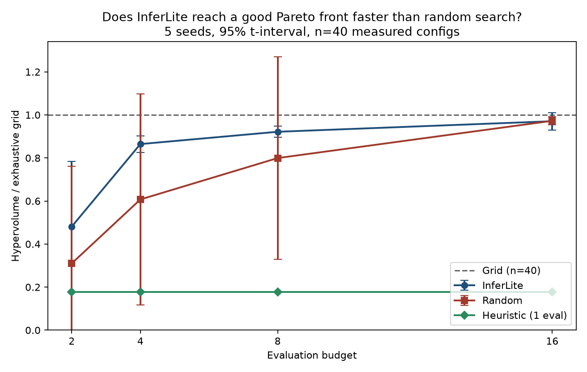
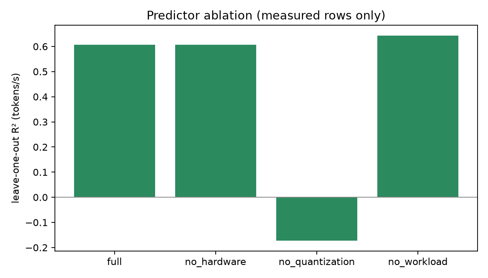

# InferLite

**Hardware-aware multi-objective LLM inference optimization**

InferLite searches a configuration space (quantization, context, decode length) on the machine you have, times only what loads, and returns a Pareto front. Missing kernels are **unsupported**, not scored. Result tables are **measured**, never simulated Llama-3-8B / TensorRT numbers.

[](https://colab.research.google.com/github/Shivani767/llm-inferlite/blob/main/notebooks/inferlite_colab.ipynb)

Paper: [`docs/paper.md`](docs/paper.md) · Raw artifacts: [`docs/results/`](docs/results/)

## Research question

**Can a hardware-aware multi-objective optimizer identify near-Pareto-optimal LLM inference configurations using substantially fewer measurements than exhaustive search?**

That is a testable claim: grid vs random vs heuristic vs InferLite, same search space, hypervolume vs evaluation budget, multiple seeds.

## Method

1. Probe hardware and libraries (CUDA / MPS / bitsandbytes / AWQ / GPTQ / llama.cpp / vLLM).
2. Enumerate a filtered search space. Drop unsupported methods instead of ranking them last.
3. Wall-clock greedy decode. Record TTFT, tokens/s, P50/P95/P99, memory, load time, 95% CI on repeated runs.
4. Time the **exhaustive grid once**. Replay **random**, **hardware heuristic**, and **InferLite** (ridge surrogate) on those measured records at budgets 2 / 4 / 8 / 16 and five seeds. Hypervolume vs grid.
5. Fit a predictor (hardware + quantization + workload → P95, tokens/s, memory). Ablate each feature group with leave-one-out R².

**measured** — timed here · **unsupported** — did not run · **error** — attempted and failed

`python -m research simulate` is a Poisson **queueing** model for capacity planning. It is not an LLM benchmark. Do not cite it, the FastAPI advisor, or old Llama-3-8B TensorRT tables as measurements.

## Architecture

```
                RESEARCH QUESTION
                       │
                       ▼
             Hardware + Workload
                       │
                       ▼
              Configuration space
                       │
                       ▼
                Real measurements
                       │
          ┌────────────┼────────────┐
          ▼            ▼            ▼
        Grid         Random      Heuristic
                       │
                       ▼
                   InferLite
                       │
                       ▼
                Pareto frontier
                       │
                       ▼
               Hypervolume vs budget
                       │
                       ▼
                Predictor + ablation
```

Code path: `configs/*.yaml` → `research.runner` → engine + search + predictor → JSON/CSV + figures.

Centerpiece experiment: **InferLite vs random as the evaluation budget grows** on Mac (`optimizer_macbook_scale.yaml`) and T4 (`optimizer_colab_t4_scale.yaml`).

## Experimental setup

| | MacBook | Colab |
|--|---------|-------|
| Device | Apple MPS | Tesla T4 |
| Models timed | GPT-2 / DistilGPT-2 | TinyLlama 1.1B (HF + GGUF) |
| Not timed | Llama-3 / Mistral / Qwen 7B+ | Llama-3 / Mistral / Qwen 7B+ |
| Optimizer (centerpiece) | **40 configs**, 5 seeds, budgets 2/4/8/16 | **30 configs**, 5 seeds, budgets 2/4/8/16 |
| Optimizer (pilot) | 8 configs, seed 42, budget 4 | 4 configs, seed 42, budget 2 |

YAML, `backend/requirements.txt` (Mac) and `backend/requirements-colab.txt` (Colab only — never full `requirements.txt` on Colab).

## Results



Seven **measured** studies. Different models and backends — do not stack the tables. Raw logs live under [`docs/results/`](docs/results/).

| Study | Model | Device | Artifacts |
|-------|-------|--------|-----------|
| **Scale search** | GPT-2 | MacBook MPS | [`docs/results/optimizer_macbook_scale/`](docs/results/optimizer_macbook_scale/) |
| **Scale search** | TinyLlama 1.1B | Colab T4 | [`docs/results/optimizer_colab_t4_scale/`](docs/results/optimizer_colab_t4_scale/) |
| Measurement suite | GPT-2 | MacBook MPS | [`docs/results/macbook_mps_gpt2/`](docs/results/macbook_mps_gpt2/) |
| T4 lite (Hugging Face) | TinyLlama 1.1B | Colab T4 | [`docs/results/colab_t4_lite/`](docs/results/colab_t4_lite/) |
| T4 llama.cpp | TinyLlama Q4_K_M | Colab T4 | [`docs/results/colab_t4_gguf/`](docs/results/colab_t4_gguf/) |
| Search pilot | GPT-2 | MacBook MPS | [`docs/results/optimizer_macbook/`](docs/results/optimizer_macbook/) |
| Search pilot | TinyLlama 1.1B | Colab T4 | [`docs/results/optimizer_colab_t4/`](docs/results/optimizer_colab_t4/) |

### InferLite vs random (n=40, 5 seeds)

Same 40-point GPT-2 / MPS space. Grid timed once (40 wall-clock jobs). Budgeted strategies replay those records. HV is throughput–memory hypervolume relative to exhaustive grid. 95% CI is the Student-t interval over five seeds.

| Budget | InferLite mean (std) [95% CI] | Random mean (std) [95% CI] | InferLite mean > random? |
|-------:|------------------------------:|---------------------------:|:-------------------------|
| 2 | 0.48 (0.24) [0.18, 0.78] | 0.31 (0.36) [−0.14, 0.76] | yes |
| 4 | **0.86 (0.03) [0.83, 0.90]** | 0.61 (0.39) [0.12, 1.10] | yes |
| 8 | 0.92 (0.02) [0.90, 0.95] | 0.80 (0.38) [0.33, 1.27] | yes |
| 16 | 0.97 (0.03) [0.93, 1.01] | **0.97 (0.01) [0.95, 0.99]** | no |

Heuristic is 0.18× at every budget (one FP16 pick). Random’s budget-2 CI crosses below 0 because n=5 and the sample is unstable; HV/grid cannot be negative.

**InferLite does not always beat random.** On this Mac space it reaches ~86% of grid hypervolume at 4 evaluations (10% of the space) with low variance. Random gets there eventually: at 16 evaluations both are ~0.97× and random is slightly ahead.

### InferLite vs random (T4 TinyLlama, n=30, 5 seeds)

Same protocol on a Colab Tesla T4. 30 wall-clock jobs, `warmup_runs=1`. First FP16 row is ~33 tok/s, not the n=4 cold start.

| Budget | InferLite mean (std) [95% CI] | Random mean (std) [95% CI] | InferLite mean > random? |
|-------:|------------------------------:|---------------------------:|:-------------------------|
| 2 | 0.33 (0.31) [−0.05, 0.71] | **0.61 (0.45) [0.05, 1.17]** | no |
| 4 | 0.49 (0.40) [−0.01, 0.99] | **0.96 (0.02) [0.93, 0.98]** | no |
| 8 | **0.97 (0.03) [0.93, 1.01]** | 0.97 (0.02) [0.94, 0.99] | yes |
| 16 | **0.995 (0.005) [0.988, 1.001]** | 0.990 (0.011) [0.976, 1.004] | yes |

Heuristic is 0.19× at every budget.

**On T4, random is ahead at budgets 2 and 4.** InferLite only catches up at 8–16 evaluations. That is the opposite of the Mac ranking at budget 4. The research question is *when* InferLite beats random, not a claim that it always does.


### Pilot tables (kept on purpose)

**Mac GPT-2 / MPS** (8 configs, budget 4, **seed 42 only**):

| Strategy | Evals | HV / grid |
|----------|------:|----------:|
| Grid | 8 | 1.00 |
| Random | 4 | **0.32** |
| InferLite | 4 | 0.30 |
| Heuristic | 1 | 0.22 |

On this seed random slightly beat InferLite. Neither recovered the full front. n=8 is small. Cite the n=40 curve above, not this ranking, for the optimizer claim.


**Colab TinyLlama / T4** (4 configs, budget 2, seed 42):

| Strategy | Evals | HV / grid |
|----------|------:|----------:|
| Grid | 4 | 1.00 |
| InferLite | 2 | **0.85** |
| Heuristic | 1 | 0.22 |
| Random | 2 | 0.041 |

n=4; first FP16 job had `warmup_runs=0` (cold start). Do not copy these HV numbers onto the Mac table or the n=30 T4 scale table.


### Predictor ablation

Ridge models: hardware + quantization + workload → P95, tokens/s, memory. Leave-one-out.

**Mac, n=40:** full P95 R² **0.71**, tokens/s **0.61**, memory **0.999**. Drop quantization → tokens/s and memory collapse (R² −0.17 / −0.17). Drop workload → P95 collapses (R² 0.02). Hardware features do nothing on one Mac.



**T4, n=30:** full P95 R² **0.84**, tokens/s **0.68**, memory **0.999**. Drop quantization → tokens/s and memory collapse (R² −0.22 / −0.24). Drop workload → P95 falls to 0.21.


**Mac, n=8 (pilot):** full P95 R² 0.86, tokens/s 0.51, memory 0.999.

**T4, n=4 (pilot):** memory R² **0.999**; P95 and tokens/s R² negative (**−6.66 / −8.44**). Kept on purpose: the predictor failed to generalize with four observations. n=30 is the T4 predictor to cite, not a patched n=4 table.

### What actually ran (not Llama-3)

**T4 TinyLlama, 16 new tokens** — backends labeled; memory is not comparable across llama.cpp vs Hugging Face:

| Backend | Method | tok/s | P95 e2e (ms) | Memory |
|---------|--------|------:|-------------:|--------|
| llama.cpp | GGUF Q4_K_M | **172.5** | **105.8** | 9.125 MB engine snapshot, **not** VRAM |
| Hugging Face | FP16 | 35.0 | 468 | 2108 MB CUDA |
| Hugging Face | INT4 NF4 | 15.3 | 1057 | 803 MB CUDA |

**Mac GPT-2:** FP16 211 tok/s vs FP32 146 tok/s in the measurement suite. bitsandbytes / AWQ / GPTQ / GGUF / vLLM: **unsupported** on that Mac, not ranked last.

AWQ 71 TPS, GPTQ 79 TPS, TensorRT-LLM 295 TPS, and 4.34× speculative speedup from the old playground are **not** measurements. They are not in these tables.

## Reproducibility

```bash
cd backend
source .venv/bin/activate    # this Mac has no `python`; the venv provides it
python -m research capabilities
python -m research suite --config ../configs/macbook_cpu.yaml
python -m research optimize --config ../configs/optimizer_macbook_scale.yaml
python -m pytest
```

Pilot (n=8, one seed): `python -m research optimize --config ../configs/optimizer_macbook.yaml`

### T4 30-config scale (Colab)

Published: [`docs/results/optimizer_colab_t4_scale/`](docs/results/optimizer_colab_t4_scale/). Reproduce on a **clean T4** runtime:

1. Open [inferlite_colab.ipynb](https://colab.research.google.com/github/Shivani767/llm-inferlite/blob/main/notebooks/inferlite_colab.ipynb).
2. Runtime → Change runtime type → **T4 GPU** → **Restart session**.
3. Run the first three **code** cells (clone, slim pip, capabilities). Install **only** `backend/requirements-colab.txt`.
4. **Skip** lite, the n=4 search, and GGUF.
5. Run **T4 scale study** (`configs/optimizer_colab_t4_scale.yaml`). Confirm `measured 30`.

## Paper

[`docs/paper.md`](docs/paper.md)

## Limits

MPS memory is RSS. llama.cpp’s 9.125 MB is not llama.cpp VRAM. InferLite vs random depends on hardware, search-space size, and budget (Mac n=40: InferLite ahead at 2/4/8; T4 n=30: random ahead at 2/4; n=8 seed 42: random slightly ahead). T4 n=4 has a cold-start first job and a predictor that does not generalize; the n=30 T4 predictor does. Sliding-window is truncation. Speculative / continuous batching here are research loops, not vLLM. Energy, MMLU, GSM8K, HumanEval, 7B+ Llama/Mistral/Qwen, and Mac→T4 predictor transfer are not scored.

```
@software{inferlite2026,
  title = {InferLite},
  year  = {2026},
  url   = {https://github.com/Shivani767/llm-inferlite}
}
```

Apache License 2.0
