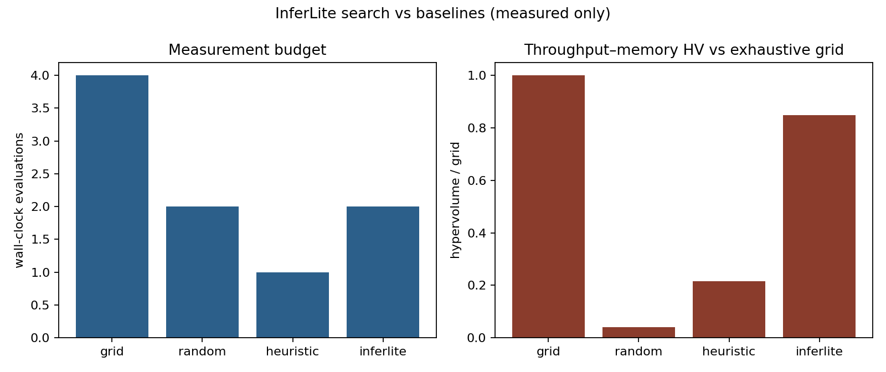
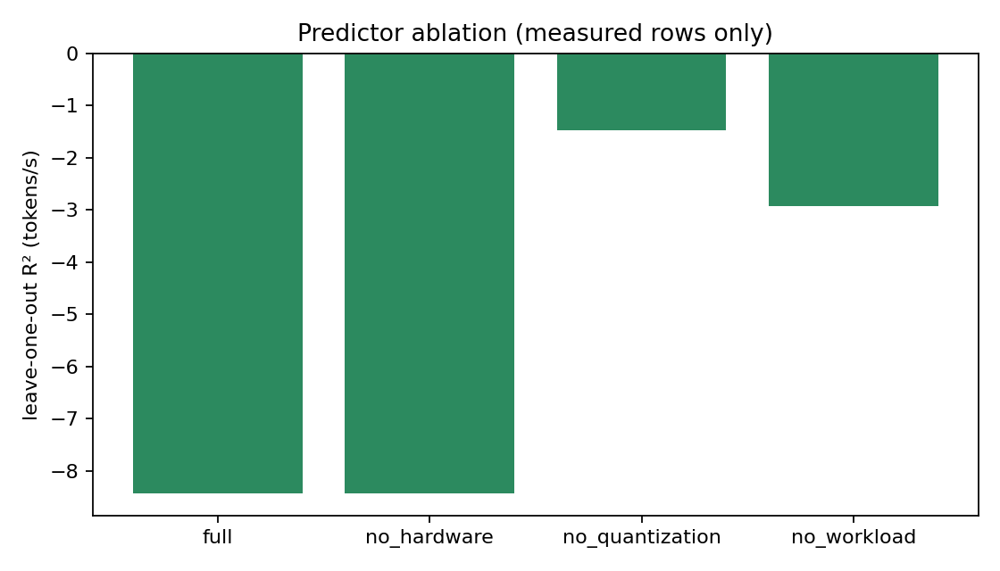

# InferLite

**Research question:** Can we find a strong LLM inference configuration for given hardware and workload **without exhaustive benchmarking** — and without inventing scores for kernels that are not installed?

InferLite probes the machine, times only what loads, and records the rest as **unsupported**. It then compares four search strategies on the same measured space: grid, random, a hardware heuristic, and a surrogate-assisted optimizer. Nothing in the result tables is simulated.

Technical write-up: [`docs/paper.md`](docs/paper.md)

## Real hardware vs simulation

| Path | What it is |
|------|------------|
| `python -m research suite` / `bench` / `optimize` | Wall-clock generation on this machine |
| `status=unsupported` | Missing GPU, library, or checkpoint — metrics left empty |
| `python -m research simulate` | Poisson **queueing** model for capacity planning — **not** an LLM benchmark |

Do not cite queueing output, legacy advisor heuristics, or old Llama-3-8B TensorRT tables as measurements.

**measured** — timed here · **unsupported** — did not run · **error** — attempted and failed

## Methodology

1. Probe capabilities (CUDA / MPS / bitsandbytes / AWQ / GPTQ / llama.cpp / vLLM).
2. Load or refuse. Greedy decode, seed 42, warmup discarded, N timed runs.
3. Record TTFT, tokens/s, P50/P95/P99, mean, std, 95% CI, RSS or CUDA memory, load time. Energy is scored only if NVML is present.
4. Pareto over **measured** rows only (min P95 + memory, max tokens/s).
5. Search study: same space, four strategies, hypervolume vs exhaustive grid.
6. Ridge predictor + leave-one-out ablation (drop hardware / quantization / workload features).

YAML configs, fixed seeds, versioned requirements, one-command runs:

```bash
cd backend
source .venv/bin/activate    # this Mac has no `python`; the venv provides it
python -m research capabilities
python -m research suite --config ../configs/macbook_cpu.yaml
python -m research optimize --config ../configs/optimizer_macbook.yaml
python -m pytest
```

If the venv is missing: `python3.12 -m venv .venv && source .venv/bin/activate && pip install -r requirements.txt`

Without activating: `.venv/bin/python -m research optimize --config ../configs/optimizer_macbook.yaml`

Colab T4: [`notebooks/inferlite_colab.ipynb`](https://colab.research.google.com/github/Shivani767/llm-inferlite/blob/main/notebooks/inferlite_colab.ipynb) — install **only** `backend/requirements-colab.txt`. Measured: Hugging Face FP16/INT4, llama.cpp Q4_K_M, and T4 search vs baselines.

## Architecture

```
configs/*.yaml  →  research.runner  →  engine + search + predictor  →  JSON/CSV + figures
```

More detail: [`docs/architecture/system_overview.md`](docs/architecture/system_overview.md). FastAPI and the queueing simulator stay in the tree as a control plane, not as the source of result tables.

## Experimental results

Five **measured** studies are published. Different models and backends — do not stack the tables.

| Study | Model | Device | Artifacts |
|-------|-------|--------|-----------|
| Measurement suite | GPT-2 / DistilGPT-2 | MacBook MPS | [`docs/results/macbook_mps_gpt2/`](docs/results/macbook_mps_gpt2/) |
| T4 lite (Hugging Face) | TinyLlama 1.1B | Colab Tesla T4 | [`docs/results/colab_t4_lite/`](docs/results/colab_t4_lite/) |
| T4 llama.cpp | TinyLlama 1.1B Q4_K_M | Colab Tesla T4 | [`docs/results/colab_t4_gguf/`](docs/results/colab_t4_gguf/) |
| Search vs baselines | GPT-2 | MacBook MPS | [`docs/results/optimizer_macbook/`](docs/results/optimizer_macbook/) |
| Search vs baselines | TinyLlama 1.1B | Colab T4 | [`docs/results/optimizer_colab_t4/`](docs/results/optimizer_colab_t4/) |

Llama-3, Mistral, and Qwen 7B+ were not timed. TinyLlama is the Llama-family model that fits a free T4.

**Same T4, TinyLlama 1.1B, 16 new tokens.** Different backends — throughput is comparable; memory is not.

| Backend | Method | tok/s | P95 e2e (ms) | Memory |
|---------|--------|------:|-------------:|--------|
| llama.cpp | GGUF Q4_K_M | **172.5** | **105.8** | 9.125 MB engine snapshot, **not** llama.cpp VRAM |
| Hugging Face | FP16 | 35.0 | 468 | 2108 MB CUDA |
| Hugging Face | INT4 NF4 (bitsandbytes) | 15.3 | 1057 | 803 MB CUDA |

llama.cpp used `llama-cpp-python` 0.3.35 (CUDA 12.4 wheel) and `n_gpu_layers=-1`. Hugging Face INT4 uses less CUDA memory than FP16. Do not plot 172 tok/s on the bitsandbytes Pareto figure.

### 1. MacBook MPS / GPT-2 (measurement suite)

29 records: **19 measured, 10 unsupported, 0 errors.** FP16 is the dense-path win over FP32. INT8/INT4/AWQ/GPTQ/GGUF/vLLM did not run on this Mac — they are absent from the comparison, not ranked last.

| Method | Status | tok/s | P95 e2e (ms) | RSS (MB) |
|--------|--------|------:|-------------:|---------:|
| FP32 | measured | 145.8 | 174.8 | 761 |
| FP16 | measured | 211.2 | 118.3 | 1064 |
| bitsandbytes / AWQ / GPTQ / GGUF / vLLM | unsupported | — | — | — |

KV cache, speculative decoding, and batching clocks: [`docs/results/macbook_mps_gpt2/`](docs/results/macbook_mps_gpt2/). Speculative acceptance was high (0.68–0.75) but wall-clock **slowed down** on this unfused MPS path. Sliding-window is prompt truncation, not fused SWA.

### 2. Colab Tesla T4 / TinyLlama 1.1B

8 records: **4 measured, 4 unsupported, 0 errors.** Exact Pareto stdout:

| Method | tok/s | P95 e2e (ms) | GPU mem (MB) |
|--------|------:|-------------:|-------------:|
| FP16 | 35.0 | 468 | 2108 |
| INT4 NF4 (bitsandbytes) | 15.3 | 1057 | 803 |

INT8 was measured and dominated (~3 tok/s on the figure). A bar labeled `gptq` loaded **dense** TinyLlama and is not cited as GPTQ. AWQ/SmoothQuant/SqueezeLLM unsupported. GGUF was unsupported in this suite (`llama_cpp` missing) and was timed later with llama.cpp (section 3).

### 3. Colab Tesla T4 / llama.cpp GGUF (TinyLlama Q4_K_M)

**1 measured, 0 unsupported, 0 error.** Same 16-new-token workload as the lite suite.

| Method | tok/s | P95 e2e (ms) | Engine mem snapshot (MB) |
|--------|------:|-------------:|-------------------------:|
| GGUF Q4_K_M | 172.5 | 105.8 | 9.125 |

`llama-cpp-python` 0.3.35, CUDA 12.4 wheel, `n_gpu_layers=-1`. This is **llama.cpp**, not Hugging Face. Full stdout: [`docs/results/colab_t4_gguf/`](docs/results/colab_t4_gguf/).

### 4. Search vs baselines (same Mac, GPT-2, 8-config space)

fp32/fp16 × context 32/96 × 8/16 new tokens. Grid: 8 measured. InferLite and random: 4 evaluations. Energy: unsupported (no NVML).

| Strategy | Evals | Hypervolume / grid |
|----------|------:|-------------------:|
| Grid | 8 | 1.00 |
| Random | 4 | **0.32** |
| InferLite | 4 | 0.30 |
| Heuristic (FP16 on MPS) | 1 | 0.22 |

On this seed, random slightly beat InferLite at half the grid budget. Neither recovered the exhaustive front. n=8 is small; the result supports the protocol, not a claim that search replaces grid on large CUDA spaces.


**Ablation (leave-one-out ridge, n=8):** full model P95 R² **0.86**, tokens/s **0.51**, memory **0.999**. Drop quantization and memory/throughput collapse (R² −1.52 / −1.26). Drop workload and P95 collapses (R² −0.72). Hardware features do nothing on a single Mac.


### 5. Search vs baselines (Colab T4, TinyLlama, 4-config space)

fp16 / INT4 × context 32 / 64 × 8 new tokens. Grid: 4 measured. InferLite and random: 2 evaluations. `warmup_runs=0`, so the first FP16-c32 job is a cold start (6.1 tok/s) versus later FP16-c64 (31.8 tok/s).

| Strategy | Evals | Hypervolume / grid |
|----------|------:|-------------------:|
| Grid | 4 | 1.00 |
| InferLite | 2 | **0.85** |
| Heuristic | 1 | 0.22 |
| Random | 2 | 0.041 |

On this seed InferLite beat random at the same budget. n=4 is small; the cold-start row hurts random. Do not copy these HV numbers onto the Mac GPT-2 table.



**Ablation (leave-one-out ridge, n=4):** memory R² **0.999**; P95 and tokens/s R² are negative (−6.66 / −8.44). Drop quantization and memory collapses (R² −2.92).



## Limits

MPS memory is RSS. llama.cpp’s 9.125 MB engine snapshot is not llama.cpp VRAM. Mac search is seed-sensitive at n=8 (random 0.32× HV vs InferLite 0.30×). T4 search is n=4 with a cold-start first job (InferLite 0.85× vs random 0.041×). Sliding-window is truncation. Speculative / continuous batching are research loops, not vLLM. Energy, MMLU, GSM8K, HumanEval, and 7B+ Llama/Mistral/Qwen are not scored here.

```
@software{inferlite2026,
  title = {InferLite},
  year  = {2026},
  url   = {https://github.com/Shivani767/llm-inferlite}
}
```

Apache License 2.0
