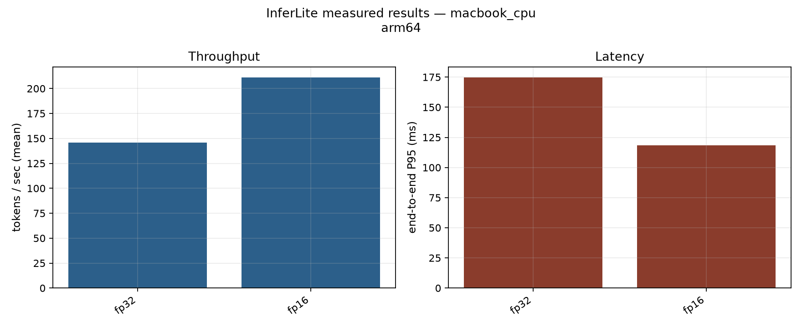
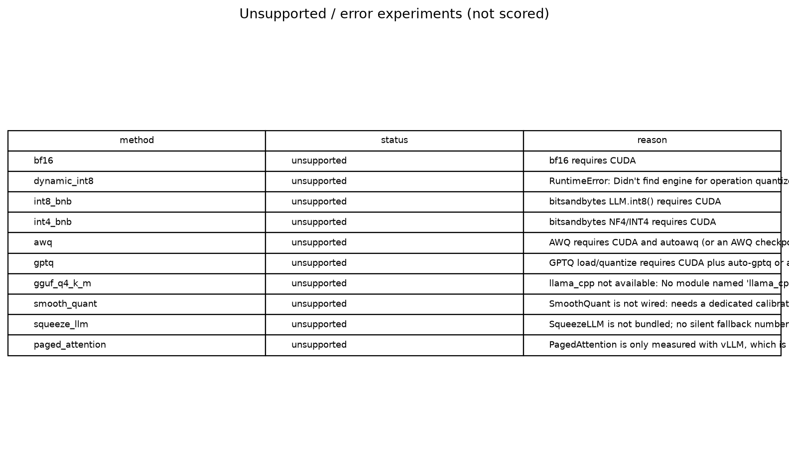
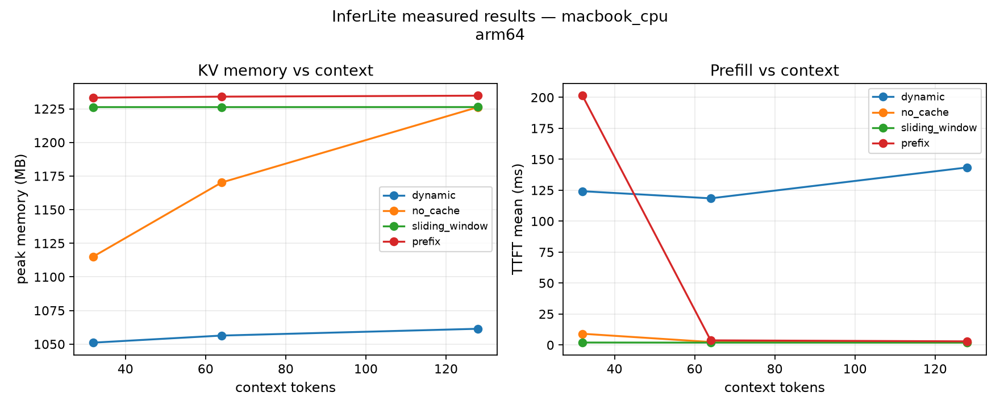
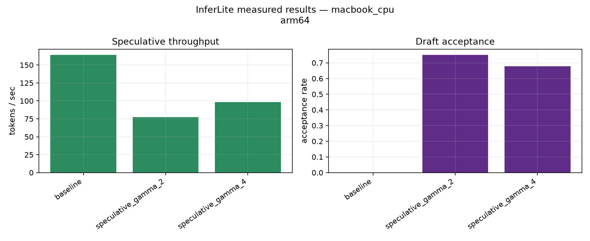
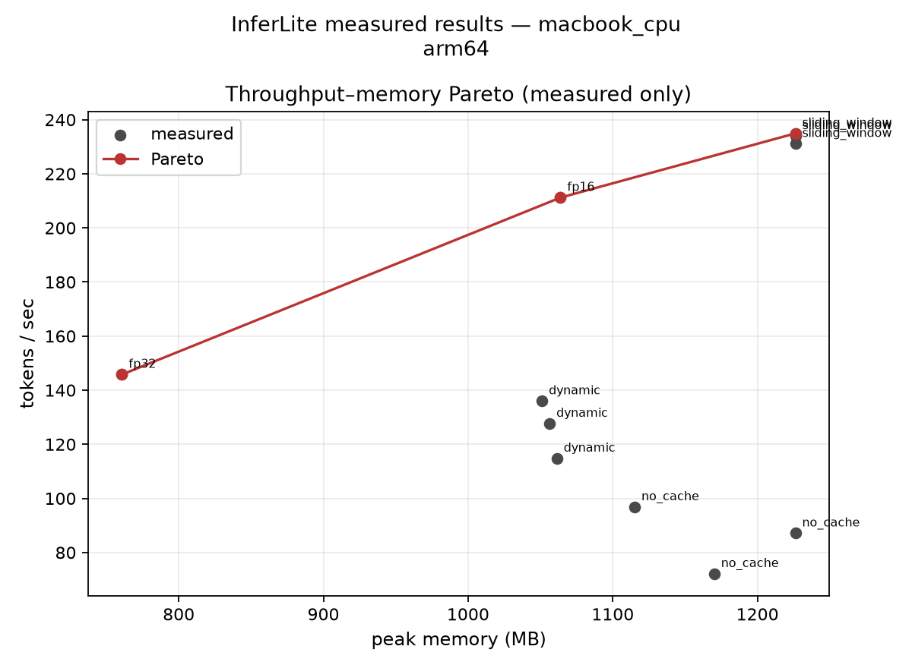

# InferLite

Wall-clock LLM inference measurements on the hardware you have — a MacBook (Apple MPS) and free Colab GPUs. Methods that cannot run are recorded as **unsupported** with a reason. Metrics are left empty. Nothing is simulated.

This page reports one completed run: **GPT-2 / DistilGPT-2**, Apple Silicon **MPS**, 2026-08-25. It is not a Llama-3-8B or TensorRT-LLM result.

**measured** — timed on this machine · **unsupported** — did not run; not scored · **error** — attempted and failed

Artifacts: [`docs/results/macbook_mps_gpt2/`](docs/results/macbook_mps_gpt2/)

---

## Logic

Published inference tables often assume CUDA kernels (AWQ, GPTQ, bitsandbytes, vLLM, TensorRT-LLM). Those stacks are not present on a typical MacBook. InferLite therefore **probes the machine first**, then times only what loads.

Each timed generation uses a prefill/decode loop:

- **TTFT** — wall time of the first forward (prefill → first token)
- **Inter-token latency** — each later decode step
- **Tokens/s** — completion tokens / end-to-end wall time
- **P50 / P95 / P99** — percentiles over measured runs
- **Memory** — process RSS on MPS (no CUDA allocator API)
- **Load time** — `from_pretrained` through a ready model

Decode is greedy (`temperature=0`), seed 42, warmup discarded, then N timed runs. Environment (OS, CPU, PyTorch, MPS/CUDA, package versions) is stored with every record.

Pareto uses **measured** rows only: minimize P95 latency and RSS, maximize tokens/s. Unsupported rows never enter the front.

---

## Setup (this run)

| | |
|--|--|
| Config | `configs/macbook_cpu.yaml` |
| Model | `gpt2` (124M); draft `distilgpt2` |
| Device | Apple MPS (`cuda=false`) |
| Stack | Python 3.12.13, PyTorch 2.13.0 (MPS), Transformers 5.15.1, Accelerate 1.14.0 |
| Prompt | `"The future of efficient language model inference is"` |
| New tokens | 24 (precision / speculative); 12 (KV); 8 (batching) |
| Warmup / repeats | 1 / 3 (2 for KV, speculative, batching) |

```bash
cd backend
python3.12 -m venv .venv && source .venv/bin/activate
pip install -r requirements.txt
python -m research suite --config ../configs/macbook_cpu.yaml
```

---

## Results

**29 records: 19 measured, 10 unsupported, 0 errors.**

### Precision

On MPS, the only dense GPT-2 variants that generated were FP32 and FP16. FP16 halved stored weights (475 → 237 MB), raised throughput **146 → 211 tok/s** (+45%), and cut P95 e2e **175 → 118 ms** (−32%). RSS went **up** (761 → 1064 MB); that is process footprint, not a CUDA `max_memory_allocated` curve.

| Method | Status | tok/s | P95 e2e (ms) | TTFT (ms) | RSS (MB) | Weights (MB) |
|--------|--------|------:|-------------:|----------:|---------:|-------------:|
| FP32 | measured | 145.8 | 174.8 | 2.16 | 761 | 475 |
| FP16 | measured | 211.2 | 118.3 | 2.43 | 1064 | 237 |
| BF16 | unsupported | — | — | — | — | needs CUDA |
| Dynamic INT8 | unsupported | — | — | — | — | no `linear_prepack` engine on this Mac PyTorch build |
| bitsandbytes INT8 / INT4 | unsupported | — | — | — | — | CUDA + bitsandbytes |
| AWQ / GPTQ | unsupported | — | — | — | — | CUDA + autoawq / auto-gptq (or a pre-quantized checkpoint) |
| GGUF Q4_K_M | unsupported | — | — | — | — | `llama-cpp-python` not installed |
| SmoothQuant / SqueezeLLM | unsupported | — | — | — | — | not implemented; no fallback numbers |

INT8/INT4/AWQ/GPTQ/GGUF are **absent from the comparison**, not ranked last. Ranking them would require a CUDA (or llama.cpp) run.





### KV cache (context 32, 64, 128)

| Name in the logs | Implementation |
|------------------|----------------|
| `dynamic` | Hugging Face `use_cache=True` |
| `no_cache` | recompute the prefix every step |
| `sliding_window` | **truncate the prompt** (not fused sliding-window attention) |
| `prefix` | second forward using `past_key_values` |
| `paged_attention` | unsupported — vLLM not installed |

With the cache on, decode stays in a band as context grows (dynamic P95 298 → 337 ms from 32 → 128 tokens). Turning the cache off makes decode expensive (no_cache P95 ~1.0 s at 64 tokens). Sliding-window rows are faster because the **prompt is shorter**, so they are not a KV-algorithm win against full-context `dynamic`.



### Speculative decoding

Greedy draft–target verification, same tokenizer family (GPT-2 / DistilGPT-2).

| | tok/s | Draft accepted | vs baseline |
|--|------:|---------------:|------------:|
| Target only | 164.0 | — | 1.00× |
| γ = 2 | 77.4 | 0.75 | 0.47× |
| γ = 4 | 98.2 | 0.68 | 0.60× |

Draft tokens matched the target often. Wall-clock still lost: two eager models and a Python verify loop on MPS cost more than they save at 24 new tokens. That is this implementation on this device — not a statement about fused speculative engines.



### Batching

Four requests, max batch 2, 8 new tokens. `model.generate()` static batch: **53.1 tok/s**. In-process continuous scheduler: **41.4 tok/s**. This is not vLLM continuous batching. Transformers warned about right-padding on a decoder-only model; clocks are still valid, but a later run should set `padding_side='left'`.

### Pareto (measured rows only)

FP32 (lowest RSS), FP16 (better tok/s and P95), and sliding-window @ 64 (highest tok/s). The last point is **not** a recommended KV strategy — truncated prompt. `no_cache` and full-context `dynamic` are dominated on this plot.



---

## Reading the numbers

On this MacBook, the working dense path is **Hugging Face + MPS**, and **FP16 is the measured win over FP32**. Kernel quantization and vLLM did not execute, so they have no TPS here. Speculative decoding showed that **acceptance rate ≠ speedup** when the verify path is unfused. KV cache vs recompute behaves as expected; do not cite sliding-window from this suite as production PagedAttention.

CUDA / Colab (TinyLlama): `notebooks/inferlite_colab.ipynb` with `configs/colab_t4_lite.yaml`. Install **only** `backend/requirements-colab.txt` — never `requirements.txt` on Colab (it reinstalls Torch/ONNX and fills the disk). After a crash: Runtime → Disconnect and delete runtime. Optional GGUF on Mac: `pip install llama-cpp-python` and set `gguf_repo` / `gguf_file`. Do not mix Colab T4 numbers with this MPS table without labeling both environments.

---

## Code

```
configs/*.yaml  →  research.runner  →  engine + experiments  →  JSON/CSV + figures
```

The engine records TTFT, tokens/s, percentiles, load time, RSS/CUDA memory, and environment. Experiments: precision/quantization, KV sweep, greedy speculative verify, static vs continuous batch, Pareto. FastAPI, ONNX lab, and a **queueing simulator** (capacity planning, not a model benchmark) are still in the tree.

```bash
python -m research capabilities
python -m research bench --model gpt2 --method fp16
cd backend && python -m pytest   # in-memory tiny GPT-2, no Hub download
```

---

## Limits of this run

MPS memory is RSS. Dynamic INT8 failed on this PyTorch build. Sliding-window is truncation. Continuous batching and speculative decode are research loops, not vLLM/TRT-LLM. AWQ/GPTQ conversion is not a calibrator here. MMLU / GSM8K / HumanEval were not run and are not invented.

```
@software{inferlite2026,
  title = {InferLite},
  year  = {2026},
  url   = {https://github.com/Shivani767/llm-inferlite}
}
```

Apache License 2.0
