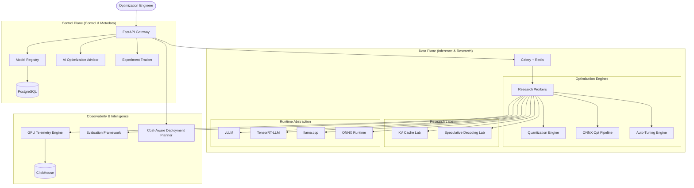

# InferLite: High-Level Architecture

## 1. System Vision
InferLite is an "Inference Operating System" designed for deep systems engineering research into LLM optimization. It bridges the gap between raw hardware capabilities and high-level application requirements by providing an automated, research-grade optimization pipeline.

## 2. Component Diagram

## 3. Core Modules
1.  **Model Registry**: Centralized management of model metadata, versions, and hashes.
2.  **Multi-Runtime Engine**: Unified interface for heterogeneous inference backends.
3.  **Quantization Engine**: Research into weight and activation compression (GPTQ, AWQ, INT8).
4.  **ONNX Optimization**: Graph-level transformations and fusion.
5.  **Auto-Tuning**: Bayesian or Grid search for optimal runtime/quantization/batch-size configs.
6.  **KV Cache Lab**: Advanced memory management (PagedAttention, Prefix Cache).
7.  **GPU Telemetry**: Real-time power, thermal, and utilization tracking.

## 4. Technology Stack
- **Language**: Python 3.12 (Strongly Typed)
- **Framework**: FastAPI (Asynchronous)
- **Database**: PostgreSQL (Metadata), ClickHouse (Telemetry), Redis (Task Queue)
- **Infrastructure**: Kubernetes, Docker, GitHub Actions
