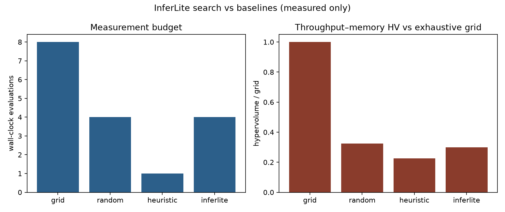
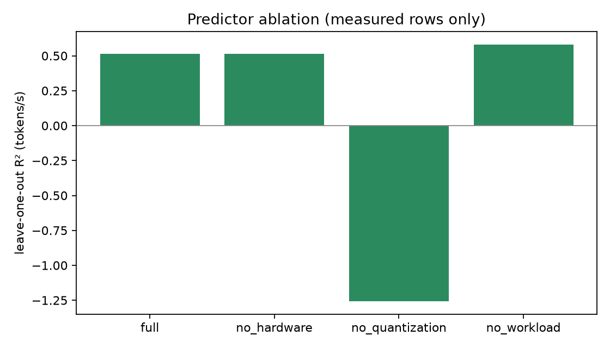

# InferLite: hardware-aware LLM inference configuration without invented scores

## Abstract

Choosing quantization, context length, and decode length for LLM inference is a multi-objective problem (latency, throughput, memory, energy, quality). Most published tables assume CUDA kernels that a laptop or free Colab GPU may not have. InferLite probes the machine, times only what loads, and labels the rest **unsupported**. On Apple MPS, GPT-2 FP16 is faster than FP32 (211 vs 146 tok/s in the measurement suite). On a Colab Tesla T4, TinyLlama FP16 is faster than bitsandbytes INT4, while INT4 uses less GPU memory. An 8-point MPS search study compares exhaustive grid search to random search, a hardware heuristic, and a surrogate-assisted InferLite optimizer. On the 2026-08-25 17:55 rerun, random recovered 0.32× of grid hypervolume versus InferLite 0.30× and the heuristic 0.22× (budget 4 vs grid 8). A ridge predictor fits memory (leave-one-out R² 0.999), P95 (0.86), and tokens/s (0.51). Dropping quantization destroys memory and throughput R²; dropping workload destroys P95 R². Energy is unsupported without NVML. No simulated tokens/s are reported as measurements.

## Research question

**Can we automatically find a strong LLM inference configuration for given hardware and workload without exhaustive benchmarking?**

Sub-questions: (1) What can actually run on a MacBook MPS and a free T4? (2) What is the measured Pareto front among those configs? (3) Can a cheap surrogate match grid hypervolume at half the evaluations? (4) Which features (hardware, quantization, workload) the surrogate actually uses?

## Related work

vLLM, TensorRT-LLM, AWQ, GPTQ, bitsandbytes, and llama.cpp provide kernels and serving stacks. Auto-tuning papers often assume those stacks are installed. InferLite is complementary: a measurement protocol and search loop that **refuses to score missing kernels**. Queueing simulation remains in the repo for capacity planning and is labeled as simulation, not a model benchmark.

## Methodology

**Real vs simulation.** Wall-clock generation goes through `research.engine.run_benchmark`. Missing libraries return `status=unsupported` with null metrics. `python -m research simulate` is a Poisson queueing model and prints a disclaimer.

**Metrics.** Greedy decode (`temperature=0`), seed 42, warmup discarded. TTFT, inter-token latency, tokens/s, P50/P95/P99, mean, std, 95% CI (normal approximation, n≥2), RSS (MPS) or CUDA allocated bytes (T4), load time. Energy: NVML if present; otherwise unsupported. Quality: optional short-passage perplexity; MMLU/GSM8K/HumanEval are not fabricated.

**Search.** Capability filter, then four strategies on the same space: grid, random (budget B), hardware heuristic (one config), InferLite (diverse seed + ridge surrogate, budget B). Objectives: minimize P95 and memory, maximize tokens/s. Hypervolume is 2-D (memory vs throughput) relative to the grid front.

**Predictor.** Independent ridge models for P95, tokens/s, and memory. Features: method one-hot, CUDA/MPS/GPU memory, log context / new tokens / batch. Ablations drop hardware, quantization, or workload groups. Validation: leave-one-out MAE, RMSE, R².

**Reproducibility.** YAML configs, fixed seed, `python -m research suite|optimize`, JSON/CSV + figures. Dependencies in `backend/requirements.txt` (Mac) and `backend/requirements-colab.txt` (Colab; do not reinstall torch).

## Architecture

```
configs/*.yaml → research.runner → engine / search / predictor → JSON/CSV + figures
```

Capability probe → load or unsupported → warmup → timed runs → Pareto over **measured** rows only.

## Experiments

| Study | Hardware | Model | What was timed |
|-------|----------|-------|----------------|
| Measurement suite | MacBook MPS | GPT-2 / DistilGPT-2 | Precision, KV, speculative, batching |
| T4 lite | Colab Tesla T4 | TinyLlama 1.1B | FP16, INT8/INT4 (bnb); AWQ/GGUF unsupported |
| Search | MacBook MPS | GPT-2 | 8-config space; grid vs random vs heuristic vs InferLite |

Llama-3-8B, Mistral, and Qwen were **not** timed here. TinyLlama is the Llama-family model that fits a free T4. Larger checkpoints remain a future measured run.

Workloads in the search study: context 32 vs 96 tokens, 8 vs 16 new tokens, batch 1, methods fp32 and fp16 (the methods this Mac can load).

## Results

### Measurement suites

See the root README and `docs/results/macbook_mps_gpt2/`, `docs/results/colab_t4_lite/`. Headline: MPS FP16 beats FP32 on GPT-2 throughput; T4 FP16 beats bitsandbytes INT8/INT4 on TinyLlama throughput; T4 INT4 wins memory.

### Search vs baselines (this paper’s new table)

8 wall-clock GPT-2 configs on MPS, 2026-08-25. InferLite/random budget = 4.

| Strategy | Evaluations | HV / grid |
|----------|------------:|----------:|
| Grid | 8 | 1.00 |
| Random | 4 | 0.32 |
| InferLite | 4 | 0.30 |
| Heuristic (prefer FP16 on MPS) | 1 | 0.22 |

Random slightly outperformed InferLite at the same budget. Neither reconstructed the exhaustive front. Treat this as evidence that the **protocol is measurable**, not that surrogate search is solved.



### Ablation

Leave-one-out ridge on the same 8 rows.

| Variant | Memory R² | Tokens/s R² | P95 R² |
|---------|----------:|------------:|-------:|
| Full | 0.9995 | 0.51 | 0.86 |
| No hardware | 0.9995 | 0.51 | 0.86 |
| No quantization | −1.52 | −1.26 | 0.84 |
| No workload | 0.983 | 0.58 | −0.72 |

Quantization features carry memory and throughput (FP16 vs FP32). Workload features carry P95 (context and new tokens). Hardware features are constant on one Mac, so dropping them changes nothing.



## Limitations

n=8 is small and search ranking is seed-sensitive. MPS RSS is not CUDA `max_memory_allocated`. Speculative decoding and continuous batching in the measurement suite are research loops, not vLLM. Sliding-window KV is prompt truncation. Energy, MMLU, and Llama/Mistral/Qwen 7B+ are unsupported here. The Colab GPTQ bar from an earlier session loaded dense TinyLlama and is not cited as GPTQ. A T4 search study was not run in this document.

## Conclusion

InferLite’s contribution is an honest measurement-and-search loop: probe, time, Pareto, compare search strategies, ablate the surrogate, and refuse fake kernels. On the hardware we have, FP16 is the dense-path win, INT4 is a T4 memory win, and a half-budget surrogate does not beat random on this 8-point MPS space. The next measured step is the T4 search cells in `notebooks/inferlite_colab.ipynb` (`configs/optimizer_colab_t4.yaml`) — still without inventing scores.

## Reproducibility commands

```bash
cd backend
source .venv/bin/activate
python -m research capabilities
python -m research suite --config ../configs/macbook_cpu.yaml
python -m research optimize --config ../configs/optimizer_macbook.yaml
python -m research predict --bundle results/optimizer_macbook/optimizer_macbook.json
python -m pytest
```

Colab: `notebooks/inferlite_colab.ipynb` and `configs/colab_t4_lite.yaml`. Install only `requirements-colab.txt`.
