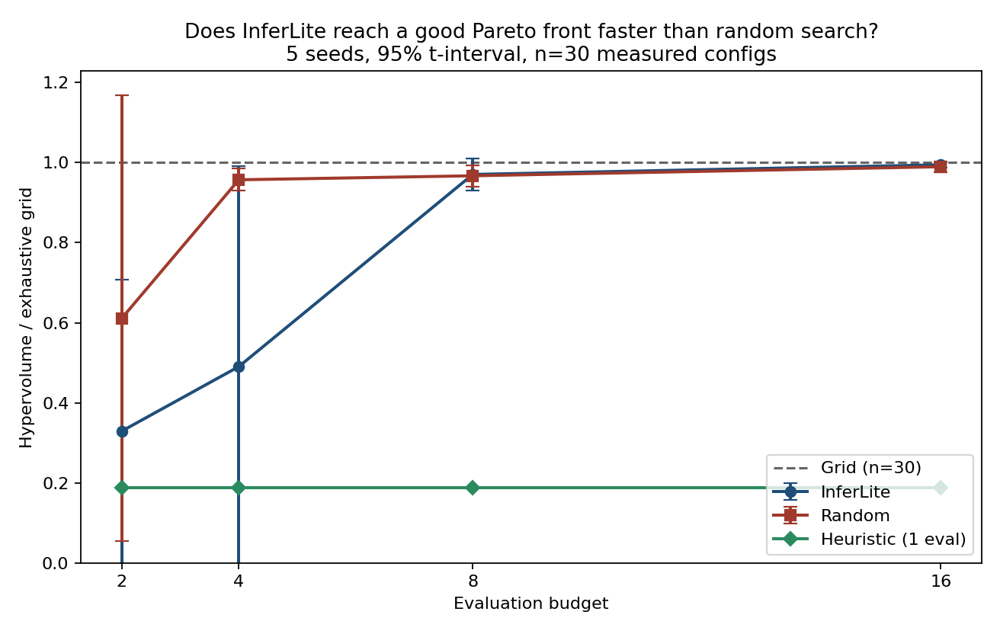
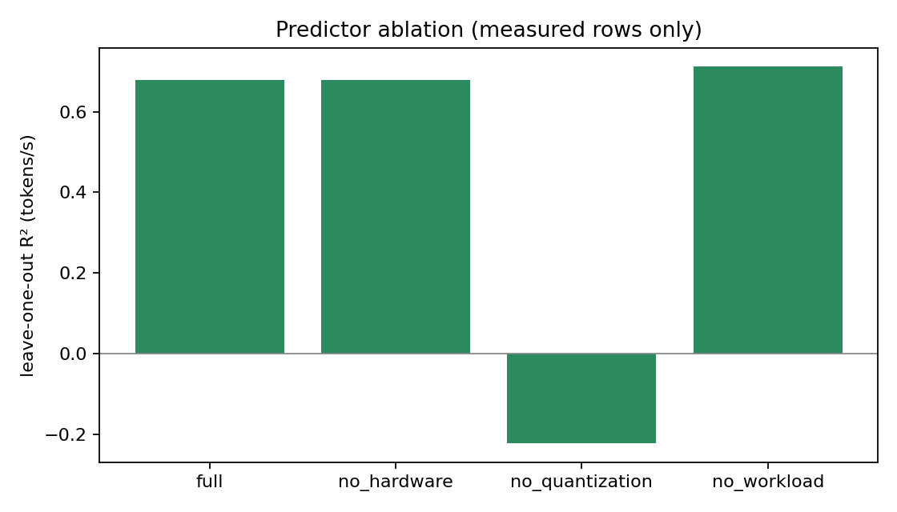

# Colab Tesla T4 scale study (TinyLlama 1.1B, n=30)

- Date (UTC): 2026-08-25 20:08
- Config: `configs/optimizer_colab_t4_scale.yaml`
- Device: Tesla T4, Google Colab
- Model: `TinyLlama/TinyLlama-1.1B-Chat-v1.0`
- Search space: **30** configs (fp16 / INT4 × context 32/48/64/96/128 × 8/12/16 new tokens)
- Grid: **30 measured, 0 unsupported, 0 error**
- Seeds: 42, 123, 456, 789, 1000
- Budgets: 2, 4, 8, 16
- `warmup_runs: 1` (first FP16 row is ~33 tok/s, not the n=4 cold start)
- `keep_one_method: true`
- Protocol: exhaustive grid timed once; random / InferLite / heuristic replay those wall-clock records

Do not mix with Mac GPT-2 HV. The 4-point T4 pilot remains in [`../optimizer_colab_t4/`](../optimizer_colab_t4/).

## InferLite vs random (key comparison)

Mean throughput–memory hypervolume / grid, 5 seeds, 95% Student-t interval.

| Budget | InferLite mean (std) | InferLite 95% CI | Random mean (std) | Random 95% CI | InferLite mean > random? |
|-------:|---------------------:|-----------------:|------------------:|--------------:|:-------------------------|
| 2 | 0.33 (0.31) | [−0.05, 0.71] | 0.61 (0.45) | [0.05, 1.17] | **no** |
| 4 | 0.49 (0.40) | [−0.01, 0.99] | **0.96 (0.02)** | [0.93, 0.98] | **no** |
| 8 | **0.97 (0.03)** | [0.93, 1.01] | 0.97 (0.02) | [0.94, 0.99] | yes |
| 16 | **0.995 (0.005)** | [0.988, 1.001] | 0.990 (0.011) | [0.976, 1.004] | yes |

Heuristic (always 1 eval): **0.19×** at every budget.

On this T4 space random is ahead at small budgets. InferLite only matches or slightly exceeds random once the budget is 8–16. That is the opposite of the Mac n=40 ranking at budget 4. Cite both tables; do not claim InferLite beats random on CUDA from this run.

t-intervals that cross below 0 are poorly calibrated (HV/grid cannot be negative). They show seed instability, not negative hypervolume.

## Predictor ablation (leave-one-out, n=30)

| Variant | P95 R² | Tokens/s R² | Memory R² |
|---------|-------:|------------:|----------:|
| Full | 0.84 | 0.68 | 0.9999 |
| No hardware | 0.84 | 0.68 | 0.9999 |
| No quantization | 0.48 | −0.22 | −0.24 |
| No workload | 0.21 | 0.71 | 0.9998 |

Thirty T4 rows are enough for a usable ridge fit. The published n=4 predictor (P95 R² −6.66, tokens/s −8.44) is left as-is: four observations were insufficient. Quantization still carries memory and throughput. Workload still carries P95.

Files: `experiments.csv`, `budget_sweep.json`, `hv_vs_budget.csv`, `comparison.json`, `ablation.json`, `optimizer_colab_t4_scale.json`, `figures/`.
